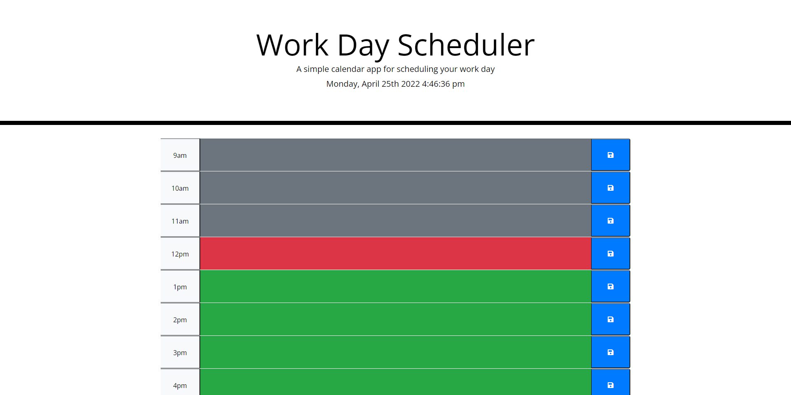

# Work Day Schedular

Homework-5: Work Day Scheduler

## Description

A webpage that allows the user to add events and/or reminders on a hourly calendar. Users will be able to save
their value in the individual hour bracket.

## Table of Contents:

- Installation
- Screenshots
- Credits
- URL

## Installation

Go to <a href="https://brobrett.github.io/workdayschedular/" alt="Brett's work day schedular"><a> to view the Webpage.

## Screenshots

[Screenshot1](./images/work-day-schedular-screenshot1.png) "Day planner front pahe showing current time and time brackets."

[Screenshot2](./images/work-day-schedular-screenshot2.png) "Day planner showing how users can enter a value into time brackets."

## Credits

- My tutor helped me multiple times with the brackets and how to use them correctly
- BCS helped a little with figuring out how to display the current time.

## URL (Github)

Click (https://github.com/BroBrett/workdayschedular) to go to the workdayschedular Github Repository

## URL (Webpage)

Click <a href="https://brobrett.github.io/workdayschedular/" alt="Brett's work day schedular">Work Day Schedular</a>